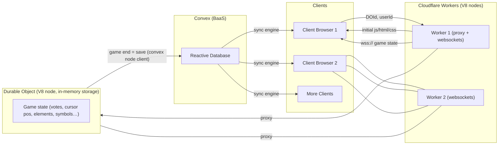

# spectra
[WIP]
## Overview

Spectra is a multiplayer game where players battle openly in an arena where everyone can see each other's work live. 

There are 3 arena types planned: 

```ts
type ArenaType = "draw" | "code" | "typing"
// of these types, draw is non-deterministic and the other two are deterministic - meaning the results of `code` and `typing` are predictable (i.e can be mathematically derived), whereas `draw` depends on vote's by judges(players and ai).
```

- draw : each player has an excalidraw canvas where they sketch out a choosen picture/diagram and judges(players and ai) vote for the best at the end.
- code(leetcode style) : each player is given a code editor to solve a leetcode style problem and whoever completes it first wins.
- typing test : players compete to type a given text as fast as possible, the fastest player wins.

There are diff modes:
- solo mode
- pvp : upto 4 players


## Architecture




## The Tech

### Backend

- Convex: reactive database backend that handles authentication, user management, and game state persistence.
- Cloudflare Durable Objects(DO): on starting a new game, a new DO is created and a websocket connection is established with the (clients) players and spectators. The DO then handles the game state and broadcasts updates to all connected clients. After game ends we terminate the DO and save the relevant game state to the convex DB.

### Frontend
- Tanstack Start: React meta-framework that provides a way to build out a good layout using router's functionality and invoking serverless functions that connect with websocket conn to our Durable Object containing game state (cf worker acts as proxy to forward conn from client->DO, and also sends initial html, css and js to clients). 
- UI framework: shadcn/ui

### Infra
- Alchemy: TypeScript-native IaC platform to deploy our tanstack start app to cf workers and our worker-DO arena servers.
- Convex: managed by them - lives in us-* region.


## dev setup

### login to cf wrangler if haven't already
```bash
bunx wrangler login
```

### login to convex if havne't already
```bash
bunx convex login
```

### run project locally

```bash
bun i
```

#### launch both f.e and b.e
```bash
bun run dev 
```
or
#### running seperately
```bash
bun run dev:web
bun run dev:convex
```


### deploy the project
```bash
bun run deploy
```


