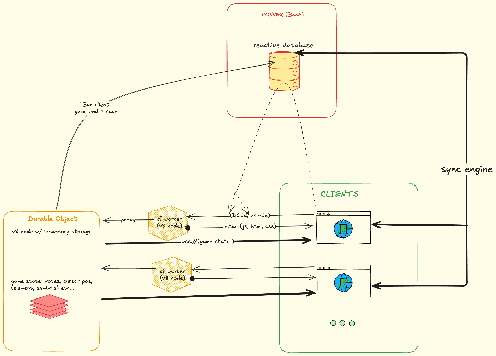
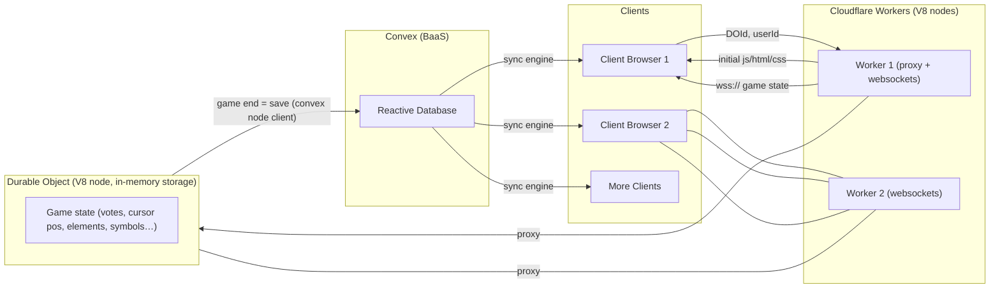

# Spectra Design Document

## Overview

Spectra is a multiplayer game where users battle openly in an arena where everyone can see each other's work live. 

There are 3 battle types planned: 

```ts
type BattleType = "draw" | "code" | "typing"
// of these types, draw is non-deterministic and the other two are deterministic - meaning the results of `code` and `typing` are predictable (i.e can be mathematically derived), whereas `draw` depends on vote's by judges(players and ai).

// this is an important point in how the game is designed.
```

- draw : excalidraw canvas where users sketch out the best drawing of a choosen picture/diagram and voters vote for the best at the end.
- code(leetcode style) : self-explanatory - coming soon
- typing test : self-explanatory - coming soon

There are diff modes:
- solo mode
- pvp : upto 4 players
- duo mode : 2v2


## Architecture





## The Tech

### Backend

- Convex: reactive database backend that handles authentication, user management, and game state persistence.
- Cloudflare Durable Objects(DO): on starting a new game, a new DO is created and a websocket connection is established with the (clients) players and spectators. The DO then handles the game state and broadcasts updates to all connected clients. After game ends we terminate the DO and save the relevant game state to the convex DB.

### Frontend
- Tanstack Start: React meta-framework that provides a way to build out a good layout using router's functionality and invoking serverless functions that connect with websocket conn to our Durable Object containing game state (cf worker acts as proxy to forward conn from client->DO, and also sends initial html, css and js to clients). 


